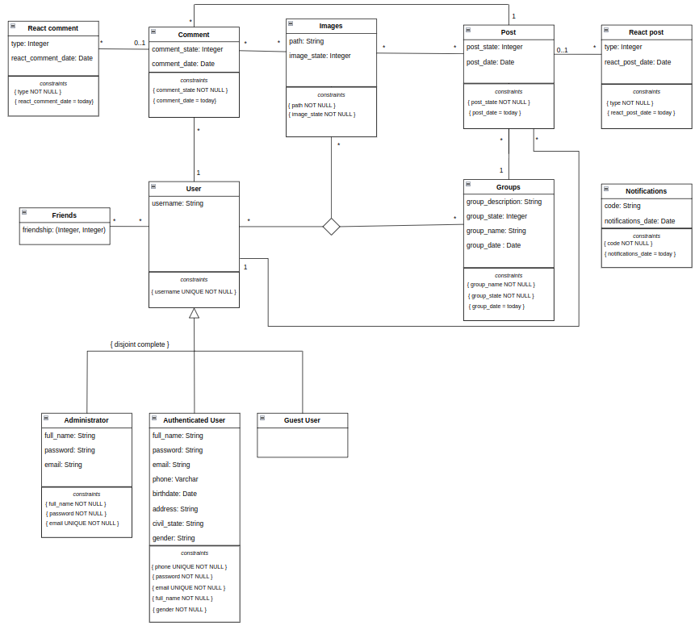

## A4: Conceptual Data Model
The Conceptual Data Model contains the identification and description of the entities and relationships that are relevant to the database specification.


### 1. Class diagram
The UML diagram presents the main organisational entities, the relationships between them, attributes and their domains, and the multiplicity of relationships for the USeless platform.


### 2. Additional Business Rules
Additional business rules or restrictions that cannot be conveyed in the UML class diagram.
| Identifier | Business Rule |
| ----------- | ------- |
| BR01 | A user can only comment and react to posts that he sees. |
| BR02 | A post cant be published with a date later than today. |


## A5: Relational Schema, validation and schema refinement
This artifact contains the Relational Schema obtained by mapping from the Conceptual Data Model. 

### 1. Relational Schema
A textual compact notation is used to document the relational schemas.
| Relation reference | Relation Compact Notation |                       
|--------------------|---------------------------|
| R01 | user (<ins>id_user</ins>, username **UK** **NN**) |
| R02 | administrator (<ins>id_user</ins> -> User, full_name **NN**, password **NN**,email **UK** **NN**) |
| R03 | authenticated_user (<ins>id_user</ins> -> User, full_name **NN**, password **NN**, email **UK** **NN**, phone **UK** **NN**, birthdate **CK** today-birthdate>=14 **NN**, address, civil_state, gender **NN**)
| R04 | gest_user (<ins>id_user</ins> -> User)
| R05 | post (<ins>id_post</ins>, post_state **NN**, post_date **NN**, id_user->User, id_groups->Groups) |
| R06 | groups (<ins>id_groups</ins>, group_description, group_state **NN**, group_name **NN**, group_date **NN**) |
| R07 | images (<ins>id_images</ins>, path **NN**, image_state **NN**) |
| R08 | comment (<ins>id_comment</ins>, comment_state **NN**,comment_date **NN**, id_user->User, id_post->Post) |
| R09 | react_comment (<ins>id_react_comment</ins>, type **NN**,react_comment_date **NN**, id_comment->Comment) |
| R10 | notifications (<ins>id_notifications</ins>,not_date **NN**, code **NN**) | 
| R11 | react_post (<ins>id_react_post</ins>, type **NN**,react_post_date **NN**, id_post->Post) |
| R12 | friends (<ins>id_friends</ins>, friendship) |
| R13 | post_images (<ins>id_post</ins>->Post, <ins>id_images</ins>->Images) |
| R14 | comment_images (<ins>id_comment</ins>->Comment, <ins>id_images</ins>->Images) |
| R15 | user_friends (<ins>id_user</ins>->User, <ins>id_friends</ins>->Friends) |
| R16 | user_groups_images (<ins>id_user</ins> ->User, <ins>id_groups</ins> ->Groups, <ins>id_images</ins> ->Images) |

Note: UK means UNIQUE KEY, NN means NOT NULL, DF means DEFAULT and CK means CHECK.

## 2.Domains

Specification of additional domains
| Domain Name | Domain Specification |
|-------------|----------------------|
|today    |  DATE DEFAULT CURRENT_DATE|

## 3.Functional Dependencies and schema validation
To validate the Relational Schema obtained from the Conceptual Data Model, all functional dependencies are identified and the normalization of all relation schemas is accomplished.
| Table R01 | user |
|-----------|------|
| Keys | {id_user}, {username} |
| Functional Dependencies: |   |
| FD0101 | id_user ->{username} |
| FD0102 | username -> {id_user} |
| Normal form | BCNF |

| Table R02 | administrator |
|-----------|---------------|
| Keys | {id_administrator}, {email} |
| Functional Dependencies: |   |
| FD0201 | id_administrator ->{full_name, password, email} |
| FD0202 | email ->{id_administrator, full_name, password} |
| Normal form | BCNF |

| Table R03 | authenticated_user |
|-----------|------|
| Keys | {id_authenticated_user}, {birthdate} |
| Functional Dependencies |  |
| FD0301 | id_authenticated_user ->{ full_name , password , email, phone, birthdate, address, civil_state, gender} |
|FD0302 |  birthdate ->{full_name , password , email, phone, address, civil_state, gender} | 
| Normal form | BCNF |

| Table R04 | guest_user |
|-----------|------|
| Keys | {id_guest_user} |
| Functional Dependencies | None |
| Normal form | BCNF |

| Table R05 | post |
|-----------|------|
| Keys | {id_post} |
| Functional Dependencies: |   |  
| FD0201 | id_post -> {post_state, post_date} |
| Normal form | BCNF |

| Table R06 | groups |
|-----------|--------|
| Keys | {id_groups} |
| Functional Dependencies: |   |
| FD0301 | id_groups -> {group_description, group_state, group_name, group_date} |
| Normal form | BCNF |

| Table R07 | images |
|-----------|--------|
| Keys | {id_images} |
| Functional Dependencies: |   |
| FD0401 | id_images -> {path, image_state}
| Normal form | BCNF |

| Table R08 | comment |
|-----------|---------|
| Keys | {id_comment} |
| Functional Dependencies: |   |
| FD0501 | id_comment -> {comment_state, comment_date} |
| Normal form | BCNF |

| Table R09 | react comment |
|-----------|---------------|
| Keys | {id_react_comment}
| Functional Dependencies: |   |
| FD0601 | id_react_comment -> {type, react_comment_date, }
| Normal form | BCNF |

| Table R10 | notifications |
|-----------|---------------|
| Keys | {id_notifications}
| Functional Dependencies: |   |
| FD0701 | id_notifications -> {code} |
| Normal form | BCNF |

| Table R11 | react post |
|-----------|------------|
| Keys | {id_react_post} | 
| Functional Dependencies: |   |
| FD0801 | id_react_post -> {type} |
| Normal form | BCNF |

| Table R12 | friends |
|-----------|---------|
| Keys | {id_friends} |
| Functional Dependencies: | id_friends ->{friendship} |            
| Normal form | BCNF |

| Table R13 | post_images |
|-----------|-------------|
| Keys | {id_post}, {id_images} |
| Functional Dependencies: | None |
| Normal form | BCNF |

| Table R14 | comment_images |
|-----------|----------------|
| Keys | {id_comment}, {id_images} |
| Functional Dependencies: | None |
| Normal form | BCNF |

| Table R15 | user_friends |
|-----------|-------------|
| Keys | {id_user}, {id_friends} |
| Functional Dependencies: | None |
| Normal form | BCNF |

| Table R16 | user_groups_images |
|-----------|--------------------|
| Keys | {id_user}, {id_groups}, {id_images} |
| Functional Dependencies: | None |
| Normal form | BCNF |

## A.1 Database Schema
```sql
create table UserD (
  id_user serial PRIMARY KEY,
  username text UNIQUE NOT NULL
);

create table Administrator(
  id_user serial PRIMARY KEY REFERENCES UserD,
  full_name text NOT NULL,
  password text NOT NULL,
  email text NOT NULL UNIQUE
);

create table Authenticated_user(
  id_user serial PRIMARY KEY REFERENCES UserD,
  full_name text NOT NULL,
  password text NOT NULL,
  email text NOT NULL UNIQUE,
  phone VARCHAR(9) UNIQUE NOT NULL,
  birthdate date,
  address text,
  civil_state text,
  gender char NOT NULL
);

create table Gest_user(
  id_user serial PRIMARY KEY REFERENCES UserD
);

create table Groups(
  id_groups serial PRIMARY KEY,
  group_description text,
  group_state integer NOT NULL,
  group_name text  NOT NULL,
  group_date date NOT NULL
);

create table Post(
  id_post serial PRIMARY KEY,
  post_state integer NOT NULL,
  id_user integer REFERENCES UserD(id_user),
  post_date date NOT NULL,
  id_groups integer REFERENCES Groups(id_groups)
);

create table Images(
  id_images serial PRIMARY KEY,
  path text NOT NULL,
  image_state integer NOT NULL
);

create table Comment(
  id_comment serial PRIMARY KEY,
  comment_state integer NOT NULL,
  comment_date date NOT NULL,
  id_user integer REFERENCES UserD(id_user),
  id_post integer REFERENCES Post(id_post)
);

create table React_comment(
  id_react_comment serial PRIMARY KEY,
  type integer NOT NULL,
  react_comment_date date NOT NULL,
  id_comment integer REFERENCES Comment(id_comment)
);

create table Notifications(
  id_notifications serial PRIMARY KEY,
  code text NOT NULL,
  not_date date NOT NULL 
);

create table React_Post(
  id_react_post serial PRIMARY KEY,
  type integer NOT NULL,
  react_post_date date NOT NULL,
  id_post integer REFERENCES Post(id_post)
);

create table post_images(
  id_post serial REFERENCES Post(id_post),
  id_images serial REFERENCES Images(id_images),
  PRIMARY KEY(id_post, id_images)
);

create table comment_images(
  id_comment serial REFERENCES Comment(id_comment),
  id_images serial REFERENCES Images(id_images),
  PRIMARY KEY(id_comment, id_images)
);

CREATE TABLE friend (
    user_from serial REFERENCES UserD(id_user) ON DELETE CASCADE,
    user_to serial REFERENCES UserD(id_user) ON DELETE CASCADE,
    PRIMARY KEY(user_from, user_to),
    CONSTRAINT check_friend_request CHECK (user_from != user_to)
);
create table user_groups_images(
  id_user serial REFERENCES UserD(id_user),
  id_groups serial REFERENCES Groups(id_groups),
  id_images serial REFERENCES Images(id_images),
  PRIMARY KEY(id_user, id_groups, id_images)
);
```


## A6: Indexes, triggers, transactions and database population
This artifact contains the physical schema of the database, the identification and characterisation of the indexes, the support of data integrity rules with triggers and the definition of the database user-defined functions. 
Furthermore, it also contains the database workload, database transactions and contains the script to populate the database.

### 1. Database Workload
 
| **Relation reference** | **Relation Name** | **Order of magnitude**        | **Estimated growth** |
| ------------------ | ------------- | ------------------------- | -------- |
| R01                | user        | 100k (hundreds of thousands)| 100 (hundreds) / day |
| R02                | administrator | 100 (hundreds) | no growth|
| R03                | authenticated_user | 10k (tens of thousands)| 1k (thousands) / day |
| R04                | guest_user        | 10k | 1k / day |
| R05 | post| 10k | 1k / day |
| R06 | groups | 1k | 100 / day|
| R07 | images | 10k | 1k / day |
| R08 | comment | 1k | 100 / day |
| R09 | react_comment | 1k | 100 / day |
| R10 | notifications | 10k (tens of thousands) | 1k / day |
| R11 | react_post | 1k | 100 / day |
| R12 | friends | 10k (tens of thousands)| 100 (hundreds) / day|
| R13 | post_images | 1k | 100 / day |
| R14 | comment_images | 1k | 100 / day |
| R15 | user_friends | 1k | 1 / day |
| R16 | user_groups_images | 100 | 1 / day |

### 2. Proposed Indices

#### 2.1. Performance Indices
 
| **Index**           | IDX01                                  |
| ---                 | ---                                    |
| **Relation**        | UserD                                  |
| **Attribute**       |username                                |
| **Type**            | B-tree                                 |
| **Cardinality**     | Medium                                 |
| **Clustering**      | No                                     |
| **Justification**   |Table UserD is often used through a user's username. A b-tree index allows for faster access to the usernames, as the data is sorted.   |
| `SQL code`          |CREATE INDEX username_users ON UserD USING btree (username);|

| **Index**           | IDX02                                  |
| ---                 | ---                                    |
| **Relation**        | Groups                                  |
| **Attribute**       |group_name                                |
| **Type**            | B-tree                                 |
| **Cardinality**     | Medium                                 |
| **Clustering**      | No                                     |
| **Justification**   |Table Groups is often used through a group`s group_name. A b-tree index allows for faster access to the group_name, as the data is sorted.   |
| `SQL code`          |CREATE INDEX name_users ON Groups USING btree(group_name);|

#### 2.2. Full-text Search Indices 
 

| **Index**           | IDX01                                  |
| ---                 | ---                                    |
| **Relation**        | Groups                                 |
| **Attribute**       | group_description                      |
| **Type**            | GIST                                   |
| **Clustering**      | No                                     |
| **Justification**   | To provide full-text search features to look for works based on matching titles or descriptions |
| `SQL code`          |CREATE INDEX search_group ON Groups USING GIST (to_tsvector('english', group_description));|


### 3. Triggers
 
| **Trigger**      | TRIGGER01                              |
| -----------------| ---------------------------------------|
| **Description**  | To ensure that you cannot add a friend you are already friends with.|
```sql
CREATE FUNCTION friend_request()
RETURNS TRIGGER AS
$BODY$
BEGIN
    IF EXISTS (
        SELECT * 
        FROM friend 
        WHERE (user_from = NEW.user_from AND user_to = NEW.user_to) OR (user_from = NEW.user_to AND user_to = NEW.user_from)
    ) THEN
        RAISE EXCEPTION 'Friendship already exists';
    END IF;
    RETURN NEW;
END
$BODY$
LANGUAGE 'plpgsql';

CREATE TRIGGER friend_request
    BEFORE INSERT OR UPDATE ON friend
    FOR EACH ROW
    EXECUTE PROCEDURE friend_request();
```

### 4. Transactions
  
| T01  | Insert new user                                |
| --------------- | ----------------------------------- |
| Justification   | In order to maintain consistency, it's necessary to use a transaction to ensure that all the code executes without errors. If an error occurs, a ROLLBACK is issued.                  |
| Isolation level | REPEATABLE READ                     |
```sql BEGIN TRANSACTION;

SET TRANSACTION ISOLATION LEVEL REPEATABLE READ

-- Insert user
INSERT INTO UserD (id_user,username)
 VALUES ($id_user, $username);

-- Insert authenticated user
INSERT INTO Authenticated_user (id_user,full_name,password,email,phone,address,civil_state,gender)
  VALUES($id_user,$full_name,$password,$email,$phone,$address,$civil_state,$gender);
END TRANSACTION;      
```                    


## Annex A. SQL Code

### A.1. Database schema
```sql
drop table if exists UserD;
drop table if exists Administrator;
drop table if exists Authenticated_user;
drop table if exists Gest_user;
drop table if exists Groups;
drop table if exists Post;
drop table if exists Images;
drop table if exists Comment;
drop table if exists React_comment;
drop table if exists Notifications;
drop table if exists React_Post;
drop table if exists friend;
drop table if exists post_images;
drop table if exists comment_images;
drop table if exists user_groups_images;


create table UserD (
  id_user serial PRIMARY KEY,
  username text UNIQUE NOT NULL
);

create table Administrator(
  id_user serial PRIMARY KEY REFERENCES UserD,
  full_name text NOT NULL,
  password text NOT NULL,
  email text NOT NULL UNIQUE
);

create table Authenticated_user(
  id_user serial PRIMARY KEY REFERENCES UserD,
  full_name text NOT NULL,
  password text NOT NULL,
  email text NOT NULL UNIQUE,
  phone VARCHAR(9) UNIQUE NOT NULL,
  birthdate date,
  address text,
  civil_state text,
  gender char NOT NULL
);

create table Gest_user(
  id_user serial PRIMARY KEY REFERENCES UserD
);

create table Groups(
  id_groups serial PRIMARY KEY,
  group_description text,
  group_state integer NOT NULL,
  group_name text  NOT NULL,
  group_date date NOT NULL
);

create table Post(
  id_post serial PRIMARY KEY,
  post_state integer NOT NULL,
  id_user integer REFERENCES UserD(id_user),
  post_date date NOT NULL,
  id_groups integer REFERENCES Groups(id_groups)
);

create table Images(
  id_images serial PRIMARY KEY,
  path text NOT NULL,
  image_state integer NOT NULL
);

create table Comment(
  id_comment serial PRIMARY KEY,
  comment_state integer NOT NULL,
  comment_date date NOT NULL,
  id_user integer REFERENCES UserD(id_user),
  id_post integer REFERENCES Post(id_post)
);

create table React_comment(
  id_react_comment serial PRIMARY KEY,
  type integer NOT NULL,
  react_comment_date date NOT NULL,
  id_comment integer REFERENCES Comment(id_comment)
);

create table Notifications(
  id_notifications serial PRIMARY KEY,
  code text NOT NULL,
  not_date date NOT NULL 
);

create table React_Post(
  id_react_post serial PRIMARY KEY,
  type integer NOT NULL,
  react_post_date date NOT NULL,
  id_post integer REFERENCES Post(id_post)
);

create table post_images(
  id_post serial REFERENCES Post(id_post),
  id_images serial REFERENCES Images(id_images),
  PRIMARY KEY(id_post, id_images)
);

create table comment_images(
  id_comment serial REFERENCES Comment(id_comment),
  id_images serial REFERENCES Images(id_images),
  PRIMARY KEY(id_comment, id_images)
);

CREATE TABLE friend (
    user_from serial REFERENCES UserD(id_user) ON DELETE CASCADE,
    user_to serial REFERENCES UserD(id_user) ON DELETE CASCADE,
    PRIMARY KEY(user_from, user_to),
    CONSTRAINT check_friend_request CHECK (user_from != user_to)
);
create table user_groups_images(
  id_user serial REFERENCES UserD(id_user),
  id_groups serial REFERENCES Groups(id_groups),
  id_images serial REFERENCES Images(id_images),
  PRIMARY KEY(id_user, id_groups, id_images)
);


/* Indexes */

CREATE INDEX username_users ON UserD USING btree (username);

CREATE INDEX name_users ON Groups USING btree(group_name);

CREATE INDEX search_group ON Groups USING GIST (to_tsvector('english', group_description));

/*TRIGGER: */

CREATE FUNCTION friend_request()
  RETURNS TRIGGER AS
$BODY$
BEGIN
    IF EXISTS (
        SELECT * 
        FROM friend 
        WHERE (user_from = NEW.user_from AND user_to = NEW.user_to) OR (user_from = NEW.user_to AND user_to = NEW.user_from)
    ) THEN
        RAISE EXCEPTION 'Friendship already exists';
    END IF;
    RETURN NEW;
END
$BODY$
LANGUAGE 'plpgsql';

CREATE TRIGGER check_friend_request
    BEFORE INSERT OR UPDATE ON friend
    FOR EACH ROW
    EXECUTE PROCEDURE check_friend_request();

/* Transaction*/

BEGIN TRANSACTION;

SET TRANSACTION ISOLATION LEVEL REPEATABLE READ

-- Insert user
INSERT INTO UserD (id_user,username)
 VALUES ($id_user, $username);

-- Insert authenticated user
INSERT INTO Authenticated_user (id_user,full_name,password,email,phone,address,civil_state,gender)
  VALUES($id_user,$full_name,$password,$email,$phone,$address,$civil_state,$gender);
END TRANSACTION;
```
### A.2. Database population
```sql
INSERT INTO UserD (id_user,username) VALUES (1,'admin01');
INSERT INTO UserD (id_user,username) VALUES (2,'guest01');
INSERT INTO UserD (id_user,username) VALUES (3,'joao_pinto123');
INSERT INTO UserD (id_user,username) VALUES (4,'mariaCampos92');
INSERT INTO UserD (id_user,username) VALUES (5,'antonio_Sousa44');

INSERT INTO Administrator (id_user, full_name,password,email) VALUES (1,'Carlos Pinto','admin123','admin123@gmail.com');

INSERT INTO Authenticated_user (id_user,full_name,password,email,phone,address,civil_state,gender)  VALUES(3,'Joao Pinto','5215827780863615','joaopinto123@gmail.com',912309846,'1977-04-16','single','Male');
INSERT INTO Authenticated_user (id_user,full_name,password,email,phone,address,civil_state,gender)  VALUES(4,'Maria Campos','5215827780863613','mariaCampos153@gmail.com',938920367,'2000-06-20','single','Female');
INSERT INTO Authenticated_user (id_user,full_name,password,email,phone,address,civil_state,gender)  VALUES(5,'Antonio Sousa','521582778086382','sousaAntonio44@gmail.com',919218745,'1980-04-03','single','Male');

INSERT INTO Gest_user(id_user) VALUES (2);

INSERT INTO Groups (id_groups,group_description,group_state,group_name,group_date) VALUES(1,'Gaming group',0,'asdasd','2022-01-10');

INSERT INTO Post (id_post,post_state,id_user,post_date,id_groups) VALUES (1,0,3,'2022-05-01',1);

INSERT INTO Comment (id_comment,comment_state,comment_date,id_user,id_post) VALUES (1,1,'2022-05-10',3,1);

INSERT INTO React_comment (id_react_comment,type,react_comment_date,id_comment) VALUES (1,1,'2022-05-10',1);

INSERT INTO React_Post(id_react_post,type,react_post_date,id_post) VALUES (1,1,'2022-05-10',1);

INSERT INTO friend (user_from,user_to) VALUES (3,4);
```

## Revision history

Changes made to the first submission:
1. Item 1
1. ..

***
GROUP2273, 31/10/2022
 
* Rafael Cerqueira, up201910200@up.pt

* Fábio Rocha, up202005478@up.pt

* José Carvaho, up202005827@up.pt

* Tomé Cunha, up201904710@up.pt


